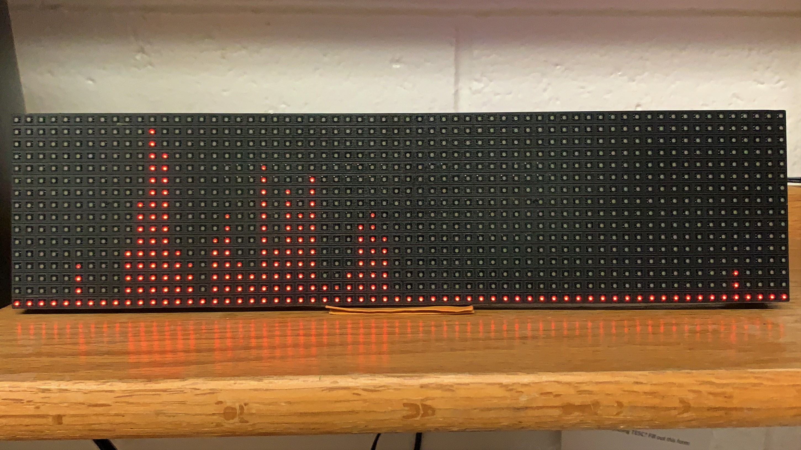
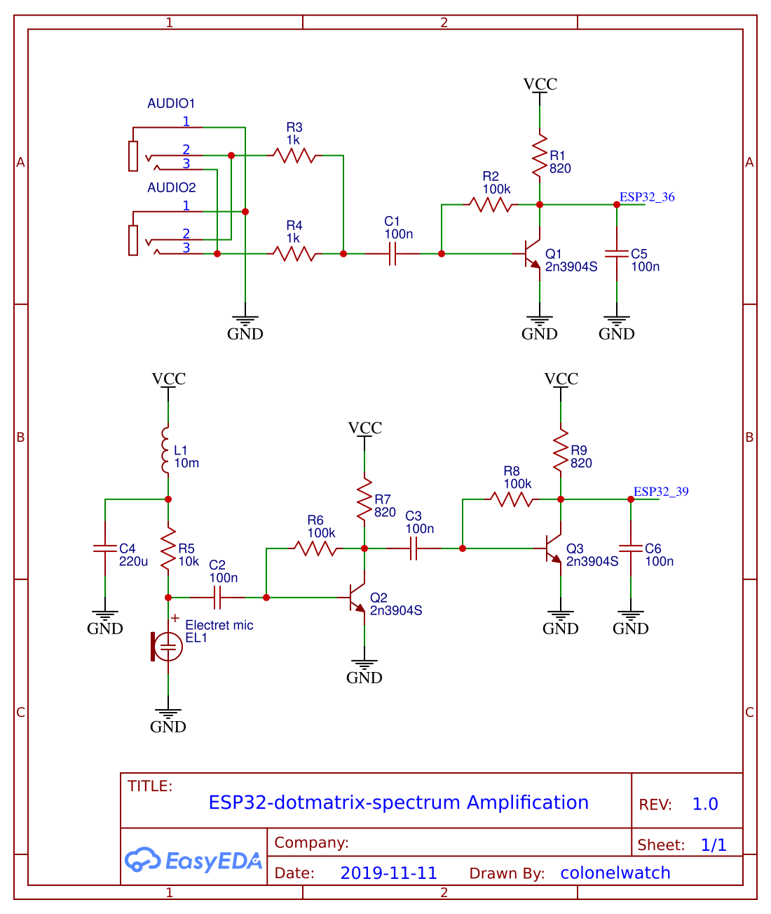

# ESP32-dotmatrix-spectrum

The goal of this Arduino program was initially to try implementing the [fix_fft](https://github.com/kosme/fix_fft) library on a 32-bit microcontroller because it was updated recently to support them, but it has since expanded into its own project. In this case, I used a dual-core ESP32, and that way I could dedicate a core to driving a 64x16 LED matrix display on the HUB08 protocol. The project is generally complete, but from here on I intend to add some unrelated features on my own device, though these won't go on this repo.

## Explanation
Except for the LED matrix driver and some ESP32-specific lines, this program is generally the same as my previous project, [attiny85-spectrum](https://github.com/colonelwatch/attiny85-spectrum). However, this time I've implemented a dynamic sampling system that increased the program's output rate by an *order of magnitude*—that is, in most music visualization projects a lot of potential processing time is wasted because the microcontroller must wait on the ADC to collect enough samples for an FFT. One can *try* to fix this by raising the ADC's clock, but this leads to an undesirable increase in the maximum frequency, way beyond normal for music. Alternatively, the same problem is caused when the sampling is already too fast, and long blocking delays are needed to maintain a desired sampling rate.

To eliminate this problem, my solution samples continuously at the desired frequency, rather than sampling all at once. It also recycles a majority of the samples for the next operation because, in principle, the FFT of any continous selection of samples remains valid. So by decoupling the sampling frequency from the ADC frequency and reducing the number of new samples needed, one can take full advantage of ADC speed, then one can further cut sampling overhead. The solution works like this:

1. Configure an interrupt to fire at a user-set frequency, and the ADC should be at its maximum possible speed.
2. When the interrupt fires, store the analog reading in a circular buffer. If the interrupt fires while the microcontroller is reading from the buffer, store the reading in a second, contingency buffer, which should be transferred over to the circular buffer at the next interrupt trigger.
3. Whenever the microcontroller needs a set of samples, read the *entire* circular buffer, starting from the oldest sample. Use a memory busy flag as a signal to the interrupt routine.

Before I implemented this method, the ESP32 could generate 100 fix_fft outputs per second; it can now do **1627.8** per second (which exceeded the ~~458~~1024.2Hz refresh rate of my LED matrix). This dynamic sampling trick can be applied on any microcontroller using interrupts, including the Arduino Uno (after raising the ADC clock).

## Implementation
Feed an amplified signal with DC bias that fits between GND and 3.3V into either GPIO36 or GPIO39. By pressing the BOOT button on the ESP32, you can switch between the two. Wire the ESP32 into the HUB08 interface 64x16 LED matrix, using the pinouts in the .ino file.

I used the above schematic to amplify the signal. The 100nF capacitors at the end attenuates the signal because my setup was getting noise above the FFT library's floor for some reason. Because of this, you may need to change the divider in line 160 if you signal has a higher level.

## Demonstration

